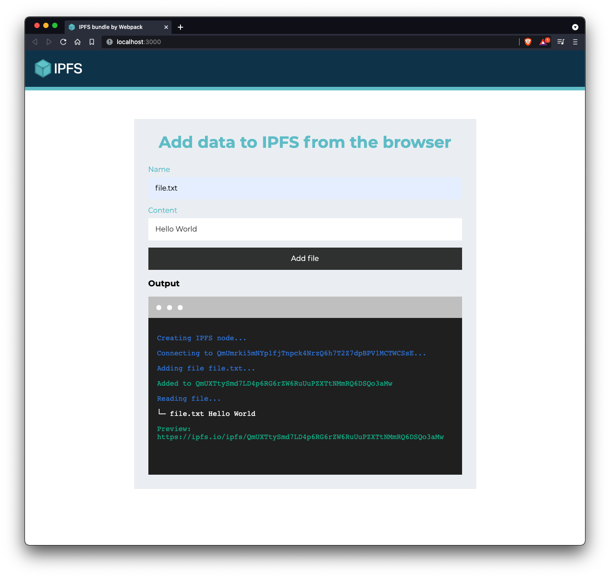

<p align="center">
  <a href="https://github.com/ipfs/helia" title="Helia">
    
  </a>
</p>

<h3 align="center"><b>Bundle Helia with Webpack</b></h3>

<p align="center">
  
  <br>
  <a href="https://ipfs.github.io/helia/modules/helia.html">Explore the docs</a>
  ·
  <a href="https://codesandbox.io/">View Demo</a>
  ·
  <a href="https://github.com/ipfs-examples/helia-examples/issues">Report Bug</a>
  ·
  <a href="https://github.com/ipfs-examples/helia-examples/issues">Request Feature/Example</a>
</p>

## Table of Contents

- [Table of Contents](#table-of-contents)
- [About The Project](#about-the-project)
- [Getting Started](#getting-started)
  - [Prerequisites](#prerequisites)
  - [Installation and Running example](#installation-and-running-example)
- [Usage](#usage)
- [Documentation](#documentation)
- [Contributing](#contributing)
- [Want to hack on IPFS?](#want-to-hack-on-ipfs)

## About The Project

- Read the [docs](https://ipfs.github.io/helia/modules/helia.html)
- Look into other [examples](https://github.com/ipfs-examples/helia-examples) to learn how to spawn a Helia node in Node.js and in the Browser
- Visit https://dweb-primer.ipfs.io to learn about IPFS and the concepts that underpin it
- Head over to https://proto.school to take interactive tutorials that cover core IPFS APIs
- Check out https://docs.ipfs.io for tips, how-tos and more
- See https://blog.ipfs.io for news and more
- Need help? Please ask 'How do I?' questions on https://discuss.ipfs.io

## Getting Started

### Prerequisites

Make sure you have installed all of the following prerequisites on your development machine:

- Git - [Download & Install Git](https://git-scm.com/downloads). OSX and Linux machines typically have this already installed.
- Node.js - [Download & Install Node.js](https://nodejs.org/en/download/) and the npm package manager.

### Installation and Running example

```console
> npm install
> npm start
```

Now open your browser at `http://localhost:3000`

## Usage

In this example, you will find a boilerplate you can use to guide yourself into bundling helia with webpack, so that you can use it in your own web app!

You should see the following:



_For more examples, please refer to the [Documentation](#documentation)_

## Documentation

- [IPFS Primer](https://dweb-primer.ipfs.io/)
- [IPFS Docs](https://docs.ipfs.io/)
- [Tutorials](https://proto.school)
- [More examples](https://github.com/ipfs-examples/helia-examples)
- [API - Helia](https://ipfs.github.io/helia/modules/helia.html)
- [API - @helia/unixfs](https://ipfs.github.io/helia-unixfs/modules/helia.html)

## Contributing

Contributions are what make the open source community such an amazing place to be learn, inspire, and create. Any contributions you make are **greatly appreciated**.

1. Fork the IPFS Project
2. Create your Feature Branch (`git checkout -b feature/amazing-feature`)
3. Commit your Changes (`git commit -a -m 'feat: add some amazing feature'`)
4. Push to the Branch (`git push origin feature/amazing-feature`)
5. Open a Pull Request

## Want to hack on IPFS?

[](https://github.com/ipfs/community/blob/master/CONTRIBUTING.md)

The IPFS implementation in JavaScript needs your help! There are a few things you can do right now to help out:

Read the [Code of Conduct](https://github.com/ipfs/community/blob/master/code-of-conduct.md) and [JavaScript Contributing Guidelines](https://github.com/ipfs/community/blob/master/CONTRIBUTING_JS.md).

- **Check out existing issues** The [issue list](https://github.com/ipfs/helia/issues) has many that are marked as ['help wanted'](https://github.com/ipfs/helia/issues?q=is%3Aissue+is%3Aopen+sort%3Aupdated-desc+label%3A%22help+wanted%22) or ['difficulty:easy'](https://github.com/ipfs/helia/issues?q=is%3Aissue+is%3Aopen+sort%3Aupdated-desc+label%3Adifficulty%3Aeasy) which make great starting points for development, many of which can be tackled with no prior IPFS knowledge
- **Look at the [Helia Roadmap](https://github.com/ipfs/helia/blob/main/ROADMAP.md)** This are the high priority items being worked on right now
- **Perform code reviews** More eyes will help
  a. speed the project along
  b. ensure quality, and
  c. reduce possible future bugs
- **Add tests**. There can never be enough tests

[cid]: https://docs.ipfs.tech/concepts/content-addressing  "Content Identifier"
[Uint8Array]: https://developer.mozilla.org/en-US/docs/Web/JavaScript/Reference/Global_Objects/Uint8Array
[libp2p]: https://libp2p.io
